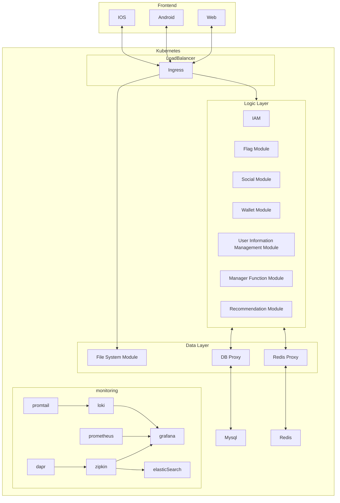

# Welcome to view oldGeneral! 🎉

oldGeneral is a Goal Management App.

## overall 
All communications use the grpc protocol

```mermaid
flowchart TD
    subgraph Frontend
        ios[IOS]
        android[Android]
        web[Web]
    end

    subgraph kubernetes[Kubernetes]
    direction LR
        subgraph LoadBalancer
            ingress[Ingress]
        end

        subgraph ll[Logic Layer]
            iam[IAM]
            flag[Flag Module]
            social[Social Module]
            wallet[Wallet Module]
            userInfo[User Information Management Module]
            manager[Manager Function Module]
            recommend[Recommendation Module]
        end

        subgraph dl[Data Layer]
            fileSystem[File System Module]
            dbapi[DB Proxy]
            redisapi[Redis Proxy]
        end

        subgraph monitor[monitoring]
        direction LR
            promtail
            loki
            dapr
            zipkin
            prometheus
            
            es[elasticSearch]

            grafana

            promtail --> loki --> grafana
            prometheus --> grafana
            dapr --> zipkin --> grafana
            zipkin --> es
        end

        db[Mysql]
        redis[Redis]

        ll <--> redisapi
        ll <--> dbapi

        redisapi <--> redis
        dbapi <--> db
    end
    ios <--> ingress
    android <--> ingress
    web <--> ingress

    ingress --> fileSystem
    ingress --> ll
```
