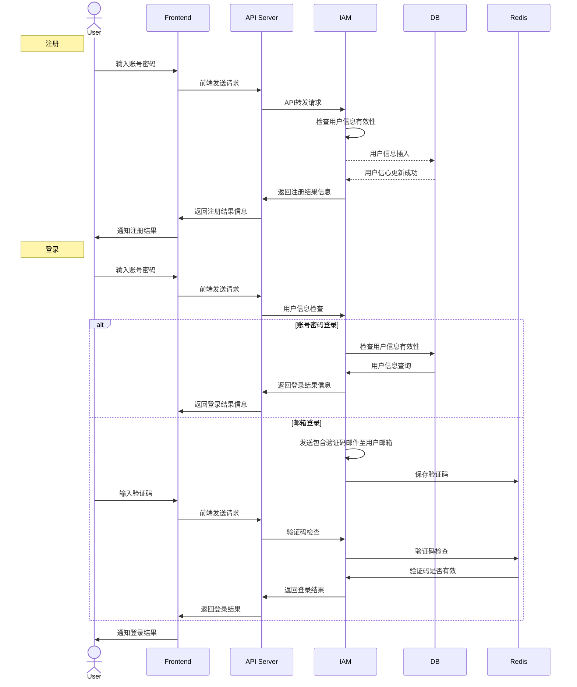

```mermaid
sequenceDiagram
    actor User
    Note left of User: 注册
    User ->> Frontend: 输入账号密码
    Frontend ->> API Server: 前端发送请求
    API Server ->> IAM: API转发请求
    IAM ->> IAM: 检查用户信息有效性
    IAM -->> DB: 用户信息插入
    DB -->> IAM: 用户信心更新成功
    IAM ->> API Server: 返回注册结果信息
    API Server ->> Frontend: 返回注册结果信息 
    Frontend ->> User: 通知注册结果

    Note left of User: 登录
    User ->> Frontend: 输入账号密码
    Frontend ->> API Server: 前端发送请求
    API Server ->> IAM: 用户信息检查
    alt 账号密码登录
        IAM ->> DB: 检查用户信息有效性
        DB ->> IAM: 用户信息查询
        IAM ->> API Server: 返回登录结果信息
        API Server ->> Frontend: 返回登录结果信息
    else 邮箱登录
        IAM ->> IAM: 发送包含验证码邮件至用户邮箱
        IAM ->> Redis: 保存验证码
        User ->> Frontend: 输入验证码
        Frontend ->> API Server: 前端发送请求
        API Server ->> IAM: 验证码检查
        IAM ->> Redis: 验证码检查
        Redis ->> IAM: 验证码是否有效
        IAM ->> API Server: 返回登录结果
        API Server ->> Frontend: 返回登录结果
    end
    Frontend ->> User: 通知登录结果

```