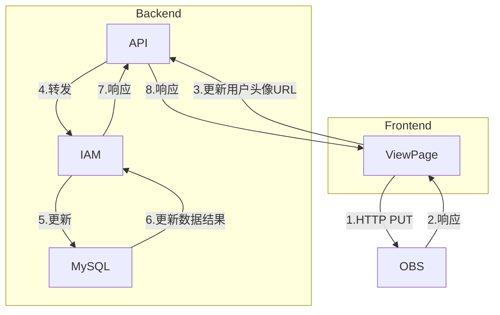

```mermaid
flowchart TB
    subgraph Backend
        API
        IAM
        MySQL
    end
    subgraph Frontend
        ViewPage
    end

    OBS

    ViewPage -->|1.HTTP PUT| OBS --> |2.响应| ViewPage
    ViewPage -->|3.更新用户头像URL| API --> |4.转发|IAM
    IAM --> |5.更新| MySQL --> |6.更新数据结果| IAM
    IAM --> |7.响应| API --> |8.响应| ViewPage
```